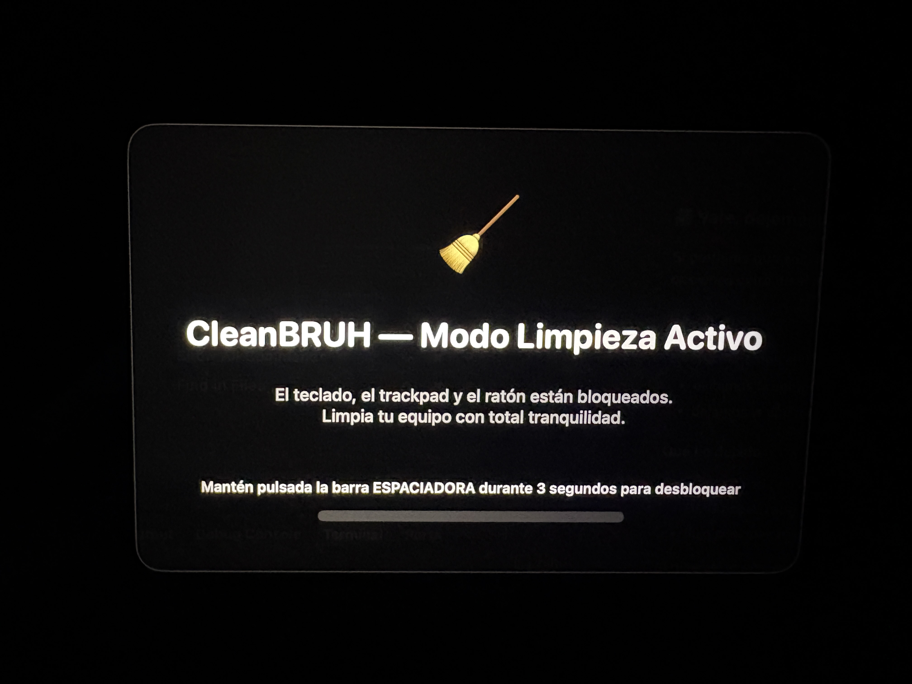

# 🧹 CleanBRUH

Mantén tu Mac protegido mientras limpias, reparas o trabajas sin que el teclado, el ratón o el trackpad te interrumpan.

  

[Download DMG](CleanBRUH-Installer.dmg)

## 🚀 Características

- 🧼 Bloquea teclado, ratón y trackpad al instante
- ⏱️ Desbloqueo rápido manteniendo pulsada la barra espaciadora
- 🖥️ Funciona desde la barra de menú de macOS
- 🔒 Requiere permisos de Accesibilidad para interceptar la entrada del sistema
- 📦 Empaquetado listo para instalar desde un archivo `.dmg`

## 📸 Vista previa

La app se ejecuta desde la barra de menú y activa una sobreimpresión oscura en todas las pantallas para dejar claro que el sistema está temporalmente bloqueado.

## 📦 Instalación

1. Descarga el archivo [CleanBRUH-Installer.dmg](CleanBRUH-Installer.dmg)
2. Abre el DMG y arrastra `CleanBRUH.app` a la carpeta `Aplicaciones`
3. Ejecuta la app y concede los permisos de Accesibilidad que macOS te pida
4. Pulsa **Iniciar Limpieza** desde la barra de menú

## 🔒 Permisos

CleanBRUH usa un event tap de macOS para bloquear la entrada del sistema. Por eso necesita acceso a **Accesibilidad**.

Si macOS no lo permite, ve a:

Ajustes del Sistema → Privacidad y seguridad → Accesibilidad

y activa CleanBRUH.

## 🛠️ Requisitos

- macOS 13 o superior
- Permisos de Accesibilidad habilitados

## 🧪 Cómo funciona

- Abre la app desde la barra de menú
- Pulsa **Iniciar Limpieza**
- La entrada del sistema queda bloqueada
- Para salir, mantén pulsada la barra espaciadora durante 3 segundos

## About

CleanBRUH está pensado para limpiar físicamente tu equipo sin tener que preocuparte de que el teclado o el ratón te interrumpan en mitad del proceso.
